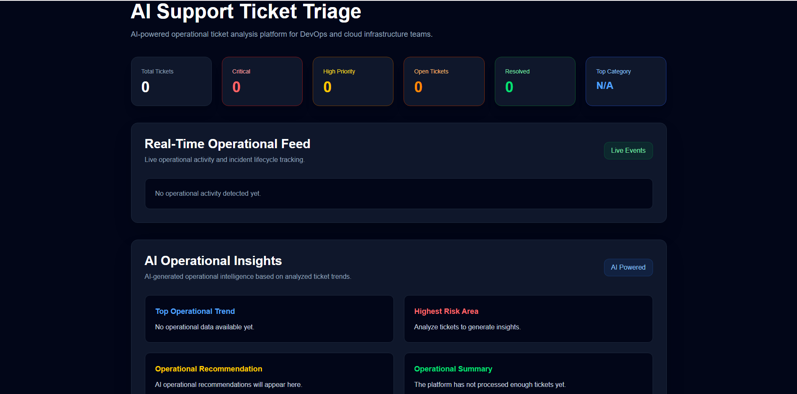
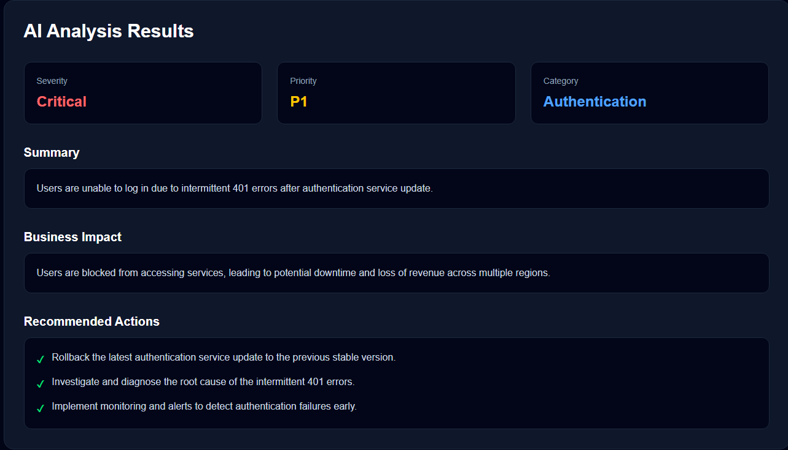
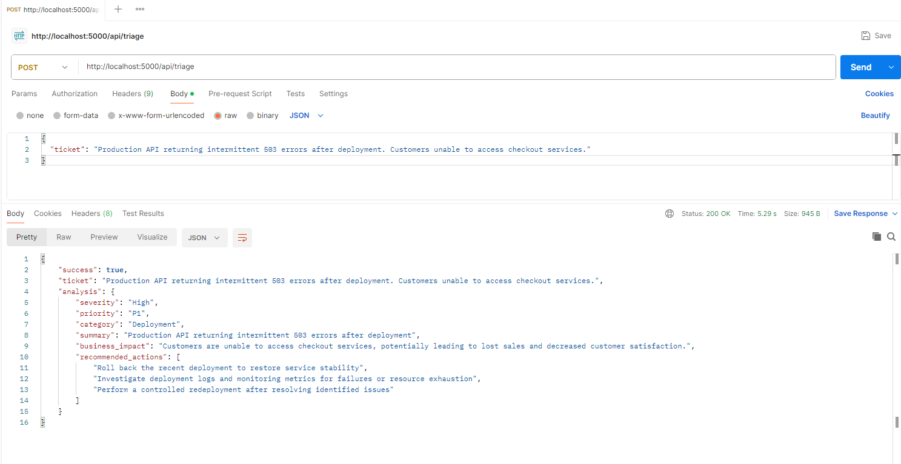
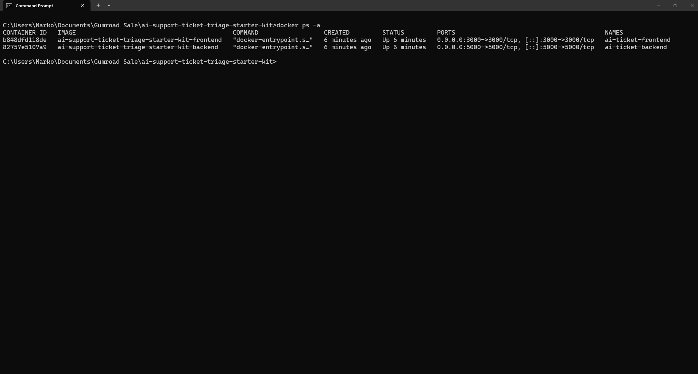

# AI Support Ticket Triage Starter Kit

Production-style AI-powered support ticket triage platform designed for DevOps, cloud infrastructure, and AI application engineering workflows.

Built with modern full-stack technologies including Next.js, Node.js, Docker, and REST APIs to simulate real-world operational incident analysis environments.

---

# Product Overview

The AI Support Ticket Triage Starter Kit is a hands-on learning project designed to help developers understand how AI-assisted operational workflows can be integrated into modern infrastructure and support environments.

This project demonstrates:

- AI-powered ticket analysis
- Operational incident classification
- Severity and priority scoring
- Dockerized frontend/backend architecture
- REST API communication
- Real-time dashboard interfaces
- Production-style project organization

Perfect for developers building AI + DevOps portfolio projects.

---

# Dashboard Preview



---

# AI Ticket Analysis



---

# API Validation with Postman



---

# Docker Container Deployment



---

# Features

- AI-powered support ticket analysis
- Severity classification engine
- Priority assignment workflows
- Business impact assessment
- Operational recommendation engine
- Real-time operational dashboard
- Dockerized frontend and backend services
- REST API integration
- Sample operational datasets
- Production-style architecture
- Beginner-friendly deployment process

---

# Technology Stack

## Frontend

- Next.js
- React
- Tailwind CSS

## Backend

- Node.js
- Express.js

## DevOps / Infrastructure

- Docker
- Docker Compose

## API / AI Workflow

- REST APIs
- JSON-based operational analysis

---

# Architecture Overview

```text
Browser
   ↓
Frontend (Next.js)
   ↓
Backend API (Node.js / Express)
   ↓
AI Ticket Analysis Engine
```

---

# Project Structure

```text
ai-support-ticket-triage-starter-kit/
│
├── frontend/
├── backend/
├── docs/
├── screenshots/
├── sample-data/
├── docker-compose.yml
├── README.md
│
└── docs/
    ├── deployment-guide.md
    └── architecture-overview.md
```

---

# Quick Start

## Prerequisites

Before starting, install:

- Docker Desktop
- Git
- Node.js (optional for local development)

---

# Clone the Repository

```bash
git clone <your-repository-url>
cd ai-support-ticket-triage-starter-kit
```

---

# Start the Application

From the project root directory:

```bash
docker compose up --build
```

Docker will:

- Build the frontend container
- Build the backend container
- Start the application services
- Expose the frontend on port 3000
- Expose the backend API on port 5000

---

# Access the Application

## Frontend Dashboard

```text
http://localhost:3000
```

## Backend API

```text
http://localhost:5000
```

---

# API Example

## Endpoint

```http
POST /api/triage
```

## Request Body

```json
{
  "ticket": "Production API returning intermittent 503 errors after deployment. Customers unable to access checkout services."
}
```

## Example Response

```json
{
  "success": true,
  "analysis": {
    "severity": "High",
    "priority": "P1",
    "category": "Deployment",
    "summary": "Production API returning intermittent 503 errors after deployment.",
    "business_impact": "Customers unable to access checkout services.",
    "recommended_actions": [
      "Roll back the latest deployment",
      "Investigate deployment logs",
      "Perform controlled redeployment"
    ]
  }
}
```

---

# Docker Commands

## Start Containers

```bash
docker compose up --build
```

## Stop Containers

```bash
docker compose down
```

## View Running Containers

```bash
docker ps
```

---

# Sample Learning Outcomes

By completing this project, you will learn:

- Docker containerization
- Multi-service orchestration
- Frontend/backend architecture
- REST API workflows
- AI-assisted operational analysis
- Production-style application structure
- Real-world troubleshooting concepts
- Modern DevOps development practices

---

# Future Expansion Ideas

This starter kit can be expanded with:

- OpenAI API integration
- PostgreSQL database support
- Authentication and authorization
- CI/CD pipelines
- AWS EC2 deployment
- Nginx reverse proxy integration
- Kubernetes deployment workflows
- Real-time WebSocket event streaming

---

# Perfect For

- DevOps Engineers
- Cloud Engineers
- AI Application Developers
- Full Stack Developers
- Platform Engineers
- Students building portfolio projects
- Developers learning Docker workflows
- Engineers exploring AI operational tooling

---

# Documentation

Additional documentation is included inside the `/docs` folder.

Included documentation:

- Deployment Guide
- Architecture Overview

---

# License

This project is provided for educational and portfolio development purposes.

---

# Disclaimer

This project is intended as a learning-focused starter kit and demonstration environment for AI-powered operational workflows.

---

# Author

Built by DemarkoCloud

Cloud • DevOps • AI Engineering